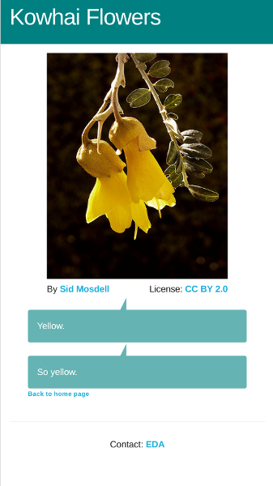

# Art Gallery

Build a photo gallery using data from a server.

Learning objectives:

1. Write simple HTTP routes with express
2. Observe how those routes connect your backend to your frontend
3. Practice testing routes.

When complete, your application might look like this:

## Setup

### 0. Cloning and installation

- [ ] After cloning this repo, install dependencies with `npm install`, and start the dev server with `npm run dev`
  

    
More about getting started

  - To start the server: `npm run dev`
  

---

### 1. A list of artworks

- [ ] Open your browser to http://localhost:5173/ to see the homepage
  

    
what's wrong?

  After trying for a while to load our artwork data, our frontend will give up and show an error.

  That's because our API hasn't been implemented yet!
  

- [ ] Read the [ArtworkListPage](./client/components/ArtworkListPage.tsx) code

- [ ] Implement a GET route in [server.ts](./server/server.ts) to serve the ArtworkListPage component

  
Hints and tips

  - use `server.get(...)` to add a route
  - that route should serve the same url as the `useQuery` in [ArtworkListPage](./client/components/ArtworkListPage.tsx)
  - import data from [art.ts](./server/data/art.ts)
  - use `res.json(...)` to respond with JSON

- [ ] Refresh your browser and see if things are working properly now

  
Hints and tips

  - Open the devtools and look for a request in your Network tab
  - Are there any errors in the console?
  - Make a GET request to the API in Postman to see if there's anything wrong

### 2. Showing the details of a specific artwork

- [ ] Open your browser to http://localhost:5173/2 to see details for an artwork
  

    
what's wrong?

  You'll see that we're having problems again, but this time it's the endpoint for
  the details of a specific artwork
  

- [ ] Make a `GET` request to `http://localhost:5173/api/v1/artwork/2` in Postman

- [ ] Add a new route to your server to serve artwork info

  
Hacks and cheats

  
  - use `server.get()` to set up a new route
  - `req.params.id` to access your path params
  - use `array.find()` to get the correct artwork
  - send it back with `res.json()` 

- [ ] Check your route in Postman

- [ ] Open your browser to http://localhost:5173/2 to see if everything is working now

### 3. Testing

- [ ] Write some tests for our routes with `supertest` and `@testing-library`
  

    
More about testing

  - These testing libraries have already been installed
  - Create a `server.test.js` and test away!
  

- [ ] Use the WAVE browser extension to find and address accessibility concerns
  

    
More about testing for accessibility

  - [Watch a video demo](https://www.youtube.com/watch?v=sdIkpL9EiN4)
  - Address any errors, contrast errors, and warnings
  

Take the chance to explore, play, experiment. Ask lots of questions!

## Stretch

  
More about stretch challenges

- We could shift the data access of our `art` object to a `data.ts` file, and only export utility functions with names like `getAll` and `getById(1)`
- How can we test those functions are working as intended?
- Add some extra styling! Consider where we store files that we will load into the browser. Maybe near the images?

## Further reading

- https://expressjs.com/en/guide/routing.html

---

[Provide feedback on this repo](https://docs.google.com/forms/d/e/1FAIpQLSfw4FGdWkLwMLlUaNQ8FtP2CTJdGDUv6Xoxrh19zIrJSkvT4Q/viewform?usp=pp_url&entry.1958421517=art-gallery)
